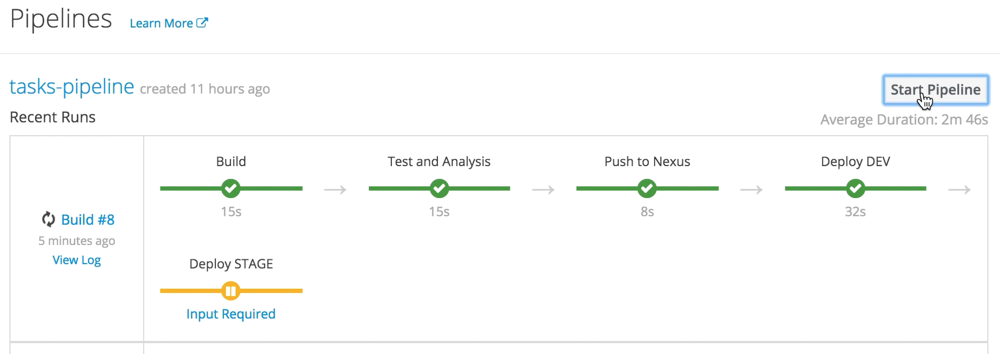
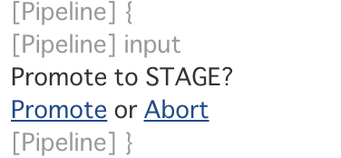

# CI/CD Demo - OpenShift Container Platform 3.6

このリポジトリには、Jenkins、Nexus、SonarQube を使用した継続的デリバリーをっしするためのインフラ構築のテンプレートとパイプライン定義が含まれています。
パイプラインでのタスクは以下の通りです。

1. Gogsリポジトリからソースコードをクローンし、ビルド、テスト、静的解析を実施
2. 作成したWARファイルをNexusリポジトリに登録
3. _Tasks_アプリケーションのWARファイルがデプロイされた JBoss EAPのDocker イメージ(_tasks:latest_)を生成
4. _Tasks_Dockerイメージを利用してDEVプロジェクトにデプロイ
5. テストが成功したらDEVプロジェクトにデプロイしたイメージに、タグ付け(_tasks:7.x._)
6. STAGEプロジェクトにデプロイするか否かの承認
7. タグ付けしたイメージを利用して、STAGEプロジェクトにデプロイ

次の図は、デプロイメントパイプラインのステップを表しています。


## システム要件
* 8+ GB メモリが OpenShift のノードサーバで利用可能であること
* JBoss EAP 7 の ImateStream がインポートされていること([see Troubleshooting section for details](README.md))

## セットアップ
dev, stage, cicd という3つのプロジェクトを作成します。
```
oc new-project dev --display-name="Tasks - Dev"
oc new-project stage --display-name="Tasks - Stage"
oc new-project cicd --display-name="CI/CD"
```

Pipelineの実行時、JenkinsコンテナがOpenShiftのAPIを通じて、stage, dev プロジェクトのコンテナイメージにアクセスします。JenkinsコンテナがOpenShiftのAPIを呼べるように権限を付与します。

```
oc policy add-role-to-user edit system:serviceaccount:cicd:jenkins -n dev
oc policy add-role-to-user edit system:serviceaccount:cicd:jenkins -n stage
```

テンプレートを利用して、CI/CDに必要なコンポーネントをデプロイします。
```
  oc process -f cicd-template.yaml | oc create -f - -n cicd
```


## セットアップ後作業

### GOGS のセットアップ
Gogs のサービスに初回アクセス時は、初期設定を行います。


#### 1. パラメータ設定

以下のとおりにパラメータを設定します。

__Database Settings__

|パラメータ名|値|
|---|---|
|Database Type|PostgreSQL|
|Host|postgresql-gogs:5432|
|User|postgresql-gogsのユーザ名(*1)|
|Password|postgresql-gogsのパスワード(*1)|
|DatabaseName|gogs|

(*1) postgresql-gogsのDeploymentConfigに定義された環境変数を参照する。

(1) OpenShiftの管理コンソールの左側のメニューから「Applications -> Deployents」を選択

(2) Deployments 一覧から「postgresql-gogs」を選択

(3) 「Environment」タブを選択

(4) POSTGRESQL_USER, POSTGRESQL_PASSWORD の値を確認

__Application General Settings__

|パラメータ名|値|
|---|---|
|Application Name|Gogs: Go Git Service|
|repository Root Path|/home/gogs/gogs-repositories|
|Run User|gogs|
|Domain|gogs サービスのRouteのホスト名(*2)|
|SSH Port|22|
|HTTP Port|3000|
|Application URL|gogs サービスのURL(*2)|
|Log Path|/opt/gogs/log|

(*2) gogs の Route に設定されたホスト名を確認する

(1) OpenShiftの管理コンソールの左側のメニューから「Applications -> Routes」を選択

(2) Routes 一覧の「gogs」のHostnameを確認


__Optional Settings__

設定なし

#### 2. 登録
画面下部の「Install Gogs」ボタンをクリックします。

### Gogsのユーザ作成

#### 1. ユーザ作成
画面上部の「Register」ボタンをクリックして、ユーザ登録ウィザードを開始します。
入力パラメータは以下のとおり

|パラメータ名|値|
|---|---|
|Username|gogs|
|Email|gogs@example.com|
|Password|gogs|
|Re-Type|gogs|
|Captcha|表示されている数字|

#### 2. 登録
画面下部の「Create New Account」ボタンをクリックします。

### Gogsへソースコード登録

Github.com で公開されているサンプルアプリケーションをGogsにインポートします。

#### 1. ログイン
先ほど作成した gogs ユーザでログインします。

#### 2. インポート
画面上部の「+」プルダウンメニューから「New Migration」を選択します。

#### 3. インポート情報の登録

|パラメータ名|値|
|---|---|
|Clone Address|https://github.com/OpenShiftDemos/openshift-tasks|
|Owner|gogs|
|Repository Name|openshift-tasks|
|Visibility|チェックせず|
|Migration Type|チェックせず|
|Description||

#### 4. 登録
画面下部の「Migrate Repository」ボタンをクリックしてインポートを開始します。


### SonarQube
初期状態で利用すると、 Quality Profile がないというエラーになるので、Quality Profileを事前に登録します。

Pipeline ビルドした時にエラーメッセージはこちら。

```
  [Static Analysis] [ERROR] Failed to execute goal org.sonarsource.scanner.maven:sonar-maven-plugin:3.0.1:sonar (default-cli) on project jboss-tasks-rs: No quality profiles have been found, you probably don't have any language plugin installed. -> [Help 1]
```


#### 1. ログイン
Sonarqubeに admin/admin でログインします。


#### 2. Update Centerの表示
画面上部のメニューから「Administration」を選択後、Administration 画面の「System」メニューから「Update Center」を選択します。

#### 3. プラグインの登録
「Available」一覧を表示後、検索キーワードに「SonarJava」を指定して検索します。
表示されたSonarJavaの右側の「Install」ボタンをクリックしてプラグインをインストールします。

#### 4. SonarQubeの再起動
画面に「SonarQube needds to be restarted in order to install 1 plugins」と表示されるので、「Restart」ボタンをクリックして再起動します。

#### 5. プラグインの確認
SonarQubeに admin/admin でログイン後、 画面上部のメニューから「Quality Profiles」を選択します。
Quality Profiles に Sonar way が登録されていることを確認します。


## Pipeline Build の実行
#### 1. OpenShift の管理コンソールへログイン
cicd プロジェクトを作成したユーザで OpenShift の管理コンソールへログインします。

#### 2. プロジェクトの選択
プロジェクト一覧から cicd プロジェクトを選択します。

#### 3. パイプライン表示
画面左側のメニューから「Builds->Pipeline」を選択します。

#### 4. パイプラインの開始
「Start Pipeline」ボタンをクリックしパイプラインを開始します。

#### 5. ステージングへのプロモーション


STAGEへのデプロイのタスクで「Input Required」のリンクをクリックし、「Promote」or 「Abort」の選択をします。



### ビルドの確認
ビルドが終わると Nexus Repository の Snapshots リポジトリにアーティファクトが登録されるので、Nexusリポジトリにログインして確認します。
